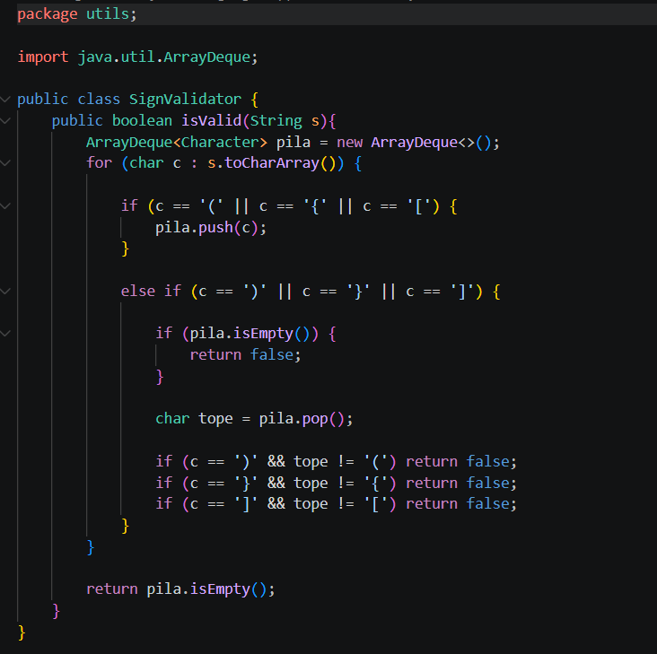
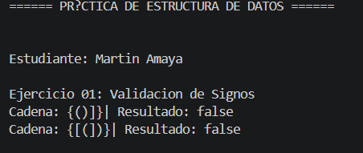
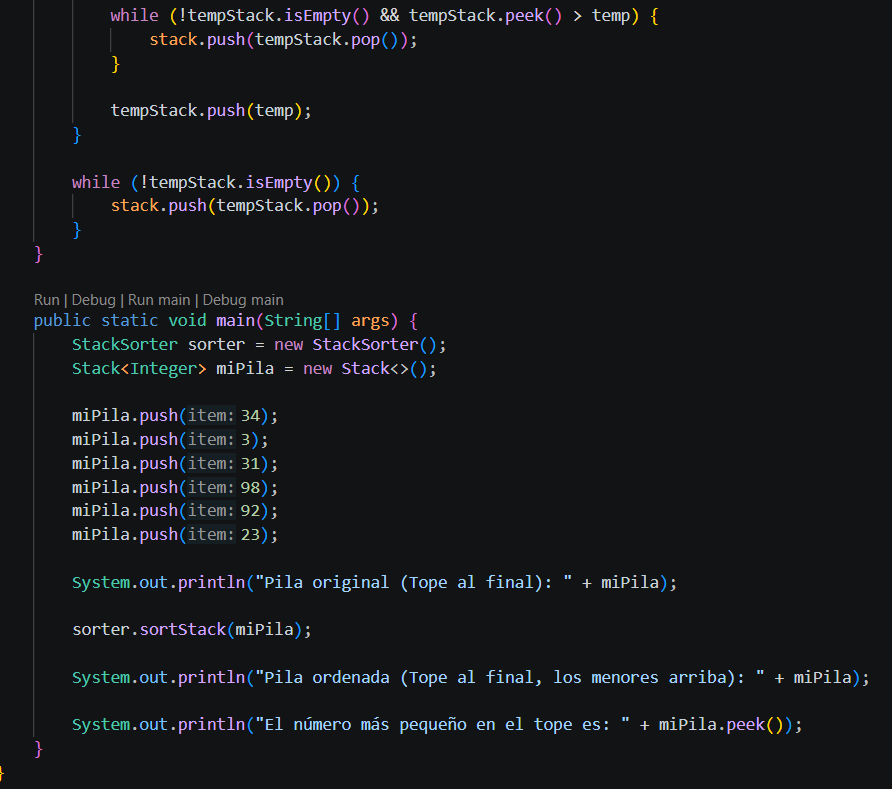
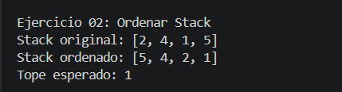
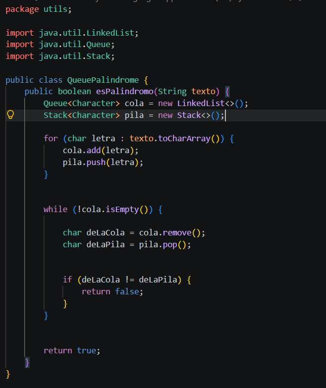
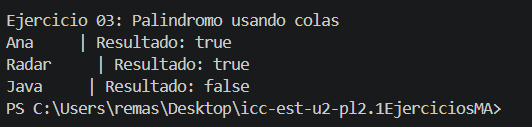

# Practica Pl2.1 Ejercicios logica con estructuras lineales: pilas y colas

**Nombre:** Renato Martin Amaya Siguenza 

## Descripcion general
Este proyecto es una práctica aplicada sobre estructuras de datos lineales en Java, enfocada en el uso y comportamiento de *Pilas (Stacks)* y *Colas (Queues). El objetivo principal del proyecto es resolver problemas algorítmicos respetando estrictamente los principios de acceso restringido de estas estructuras: **LIFO* (Last In, First Out) para las pilas y *FIFO* (First In, First Out) para las colas.

## Ejercicio 01

### Descripcion
Utiliza una Pila (Stack) para analizar un texto y comprobar matemáticamente si todos sus paréntesis (), llaves {} y corchetes [] se abren y cierran en el orden correcto respetando la regla LIFO.

**Evidencia codigo**

**Salida en consola**

## Ejercicio 02

### Descripcion
Implementa un algoritmo que organiza los números de un Stack para que el valor más pequeño quede siempre en la cima. Para lograrlo, utiliza estrictamente los métodos básicos de la pila (push, pop, peek, isEmpty) y una única pila auxiliar temporal.

**Evidencia de codigo**

**Salida en consola**

## Ejercicio 03

### Descripcion
 Determina si una palabra se lee igual al derecho y al revés extrayendo sus letras simultáneamente desde una Cola (regla FIFO, orden original) y una Pila (regla LIFO, orden inverso) para comparar que ambas secuencias sean idénticas.

**Evidencia de codigo**

**Salida en consola**

